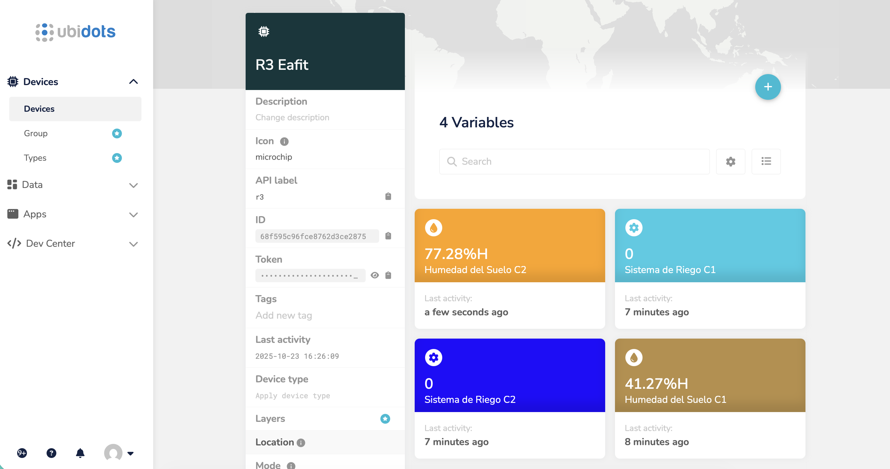
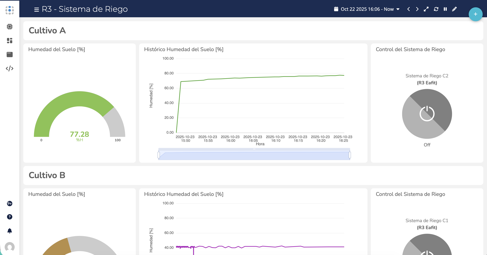
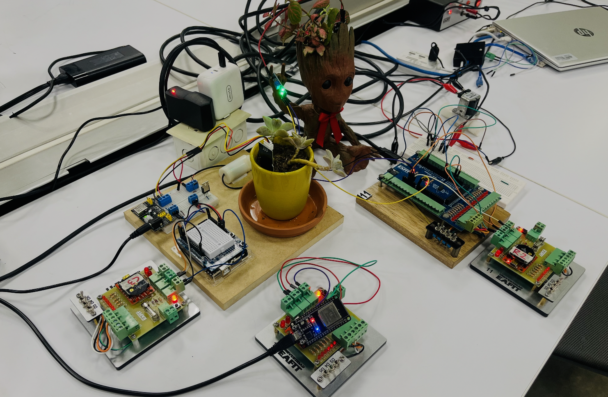

# Taller de IoT con Ubidots

El presente trabajo, de índole académico, se enfoca en practicar los conceptos básicos de IoT, utilizando el servicio de Ubidots como plataforma de gestión de datos.

## Objetivo

El objetivo de este trabajo es crear un sistema de monitoreo y control de la humedad del suelo en una planta doméstica, utilizando un sensor de humedad del suelo y un actuador que habilita el sistema de bombeo de agua. Adicionalmente, se busca practicar la comunicación entre dispositivos vía UART y la gestión de comunicaciones IoT vía MQTT.

## Arquitectura

La arquitectura del sistema es la siguiente:

- Dispositivos de control de periféricos de la finca #1 y finca #2 (Arduino UNO R3): Este dispositivo se encarga de controlar los periféricos de la planta doméstica, como el sensor de humedad del suelo y el actuador que habilita el sistema de bombeo de agua. Ver [r3_controller_1](r3_controller_1/r3_controller_1.ino)  y [r3_controller_2](r3_controller_2/r3_controller_2.ino) para más detalles.
- Dispositivo de gestión de comunicaciones IoT (ESP32 C3 SUPER MINI): Este dispositivo se encarga de gestionar las comunicaciones IoT, como la conexión a internet vía WiFi y la conexión al servidor MQTT. Adicionalmente, se encarga de enviar y recibir datos de los dispositivos de control de periféricos. Ver [r3_server](r3_server/r3_server.ino) para más detalles.

## Servicios IoT con Ubidots:

## Prototipo:

